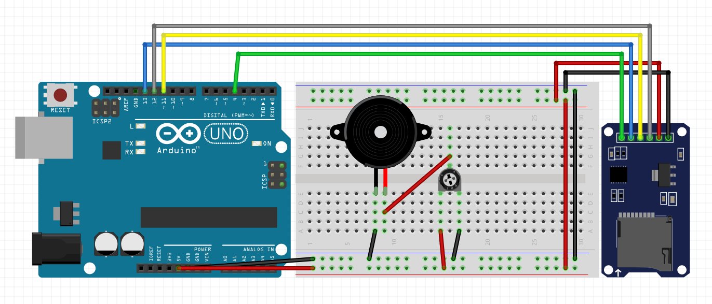

# audiophile
An 8-bit music player for the retro age.

Play all your favourite tunes from an sdcard! Just convert the song into the format specified below.

### How does it work?
A file is loaded from the SD Card whose contents are as follows:
```
...
FREQUENCY DURATION
FREQUENCY DURATION
FREQUENCY DURATION
...
```
The buzzer then plays that sound, with the potentiometer acting as a kind of volume control.

### Schematic

